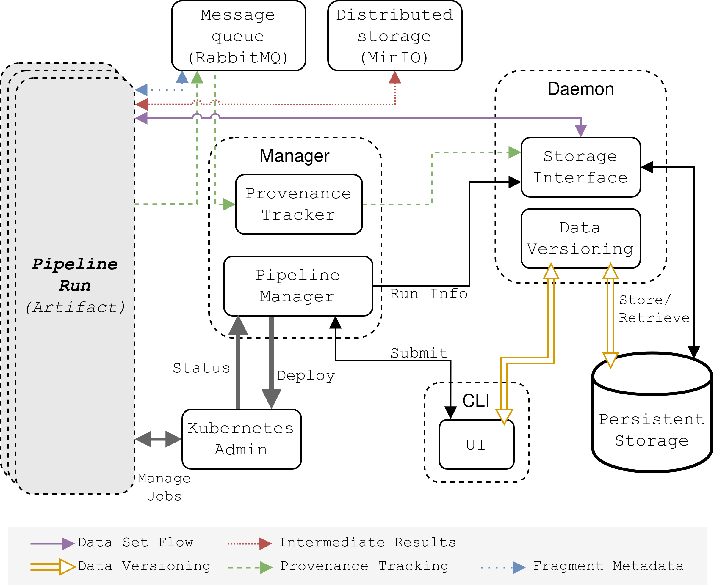

# Installation guide

Iterum consists of a couple of different components. Some off-the-shelf components such as:

- Message queing system (RabbitMQ)
- Distributed storage (MinIO)
- Kubernetes admin

But also some components specific for Iterum:

- Daemon (Data versioning server & Storage interface)
- Manager (Provenance tracker & Pipeline manager)

Additionally, there is a CLI to interact with the framework.

The following image shows an overview with the different components, and how they interact with each other:


# Setting up Iterum

### Disclaimer

Iterum is currently still in an early-alpha phase, and therefore some corners have been cut in the implementation. For instance, there are some hardcoded credentials present in the deployment steps/repositories. A better solution, such as the concept of [Secrets](https://kubernetes.io/docs/concepts/configuration/secret/) should be used in the future.

## 1. Setting up a Kubernetes cluster

Iterum requires a Kubernetes cluster to run. For a local deployment, we recommend to use a local Kubernetes implementation such as k3s, k3d, MicroK8s or Minikube. For this we refer you to the respective installation guides:

- [k3s](https://k3s.io/)
- [k3d](https://github.com/rancher/k3d)
- [Microk8s](https://microk8s.io/)
- [Minikube](https://kubernetes.io/docs/setup/learning-environment/minikube/)

Make sure that you are also able to install packages on the cluster using [helm](https://helm.sh/). After the Kubernetes cluster is set up, make sure that you are able to access the cluster using `kubectl`.

## 2. Deploy the software components

Now the software components can be deployed on the cluster. It may take some time after deployment for the components to become active, as Docker images need to be downloaded, and resources need the be allocated.

### Setting up RabbitMQ

Run the following command to install RabbitMQ on the cluster. This spawns 3 pods on the cluster for a high availability version of RabbitMQ.

```
helm install iterum-mq -f rabbit-mq-values.yaml bitnami/rabbitmq
```

### Setting up MinIO

Run the following command to install MinIO on the cluster. This spawns a pod which runs a Minio instance accessible by the Iterum.

```
helm install --set auth.rootUser=iterum,auth.rootPassword=banaanappel iterum-minio bitnami/minio
```

### Setting up the daemon

The resources required to run the daemon can be deployed using `kubectl`. The daemon currently only supports a "local" storage backend. For this, a _PersistentVolume_, and a _PersistentVolumeClaim_ need to be created before the daemon can be deployed. All of the required deployment files are found in the `daemon` subfolder of this repository. To deploy each of these resources in one command, run:

```
kubectl apply -f ./daemon
```

The `daemon/daemon.yaml` specifies the image to be used for the daemon. It is currently set to the image available on the Iterum dockerhub container registry. If you want to use a version of the daemon you build yourself, you have to change the image version in this `daemon/daemon.yaml` file.

Note that there may be slight variations in how *PersistentVolume*s should be used for each of the Kubernetes implementations. For this we refer you to the documentation of your Kubernetes version.

### Setting up the manager

The manager schedules Kubernetes _Jobs_ for pipelines. In order to do this, the manager needs the required permissions. This can be achieved by connecting the manager to a _ServiceAccount_ which is allowed to schedule _Jobs_. The required deployment files can be found in the `manager` subfolder. To deploy each of these resources in one command, run:

```
kubectl apply -f ./manager
```

The `manager/manager.yaml` specifies the image to be used for the manager. It is currently set to the image available on the Iterum dockerhub container registry. If you want to use a version of the daemon you build yourself, you have to change the image version in this `manager/manager.yaml` file.

## 3. Port-forward the daemon and the manager

The CLI requires the manager and daemon to be accessible on ports 3000 and port 3001 respectively. In a production environment, an _Ingress_ should be configured to allow access, but for this early-alpha stage, port-forwarding works fine.
The following commands need to be run to achieve this:

```
kubectl port-forward service/manager-service 3001
```

and

```
kubectl port-forward service/daemon-service 3000
```

After both services are forwarded to localhost, the CLI can be used to perform data versioning, but also the submit and manage pipelines. Instructions on how to install the CLI can be found [here](https://github.com/iterum-provenance).

## Conclusion

This concludes the setting up of Iterum. Iterum should now be accessible via the CLI, through which all of the functionalities can be used.
